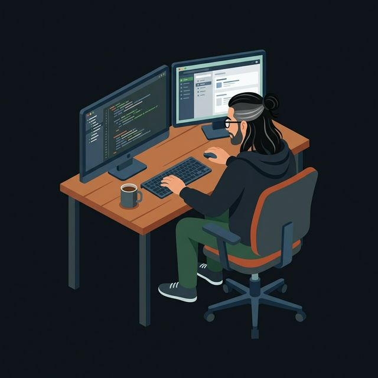

<!-- ═══════════════════════════════════════════════════════════════════════════ -->
<!-- 🎨 ANIMATED HEADER                                                        -->
<!-- ═══════════════════════════════════════════════════════════════════════════ -->

<!-- ═══════════════════════════════════════════════════════════════════════════ -->
<!-- ✍️ ANIMATED TYPING                                                        -->
<!-- ═══════════════════════════════════════════════════════════════════════════ -->

<!-- ═══════════════════════════════════════════════════════════════════════════ -->
<!-- 👤 ABOUT ME                                                               -->
<!-- ═══════════════════════════════════════════════════════════════════════════ -->

##  &nbsp;About Me

I'm a **Data Scientist & Machine-Learning Engineer** based in **Bogotá, Colombia** 🇨🇴, passionate about turning complex data into real-world impact.

- 🔬 **Analytics & ML** — End-to-end predictive models, data pipelines, and production ML systems with Python & R
- 🌐 **Open Source** — Active contributor committed to reproducible, transparent, and community-driven code
- ⛓️ **Blockchain & IPFS** — Smart contracts in Solidity paired with decentralized storage for secure data solutions
- 🏆 **Hackathons** — Polkadot hackathon winner · Active builder in the Web3 ecosystem
- 🎸 **Beyond Code** — Blues guitarist and nature walker — creativity flows best when you step away from the screen

 

<!-- ═══════════════════════════════════════════════════════════════════════════ -->
<!-- 🛠️ TECH STACK                                                             -->
<!-- ═══════════════════════════════════════════════════════════════════════════ -->

## 🛠️ &nbsp;Tech Stack

  <b>Languages & ML</b>&nbsp;&nbsp;
  
  
  
  
  
  
  
  

  <b>Blockchain & Web3</b>&nbsp;&nbsp;
  
  
  
  
  
  

  <b>Tools & Cloud</b>&nbsp;&nbsp;
  
  
  
  
  

<!-- ═══════════════════════════════════════════════════════════════════════════ -->
<!-- 🏆 TROPHIES                                                               -->
<!-- ═══════════════════════════════════════════════════════════════════════════ -->

  

<!-- ═══════════════════════════════════════════════════════════════════════════ -->
<!-- 🐍 SNAKE ANIMATION                                                        -->
<!-- ═══════════════════════════════════════════════════════════════════════════ -->

## 📈 &nbsp;Contribution Graph

  <picture>
    <source media="(prefers-color-scheme: dark)" srcset="https://raw.githubusercontent.com/Oriojas/Oriojas/output/github-snake-dark.svg" />
    <source media="(prefers-color-scheme: light)" srcset="https://raw.githubusercontent.com/Oriojas/Oriojas/output/github-snake.svg" />
    
  </picture>

<!-- ═══════════════════════════════════════════════════════════════════════════ -->
<!-- 🤝 CONNECT WITH ME                                                        -->
<!-- ═══════════════════════════════════════════════════════════════════════════ -->

## 🤝 &nbsp;Let's Connect

---

 

*"The goal is to turn data into information, and information into insight."* — Carly Fiorina

 

<!-- ═══════════════════════════════════════════════════════════════════════════ -->
<!-- 🎨 ANIMATED FOOTER                                                        -->
<!-- ═══════════════════════════════════════════════════════════════════════════ -->

